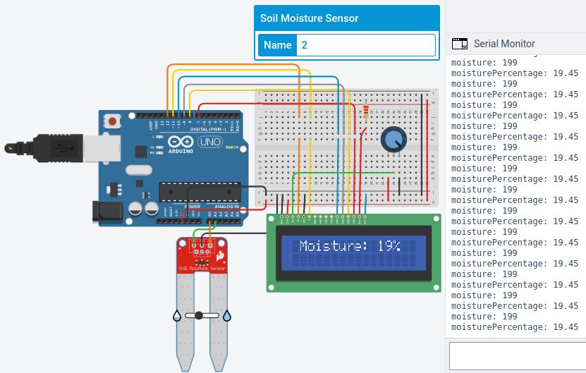

# moist-and-colorful

A team project that I participated in a year ago and was responsible  for the coding part, It is an Arduino-powered machine that measures the moisture of some soil and represents the level of moisture on five colored LEDs.  
We were going to use an LCD screen but found the LED bulbs idea to be more practical. Nevertheless, this repo shows the project in both ways.
- - - -

## Project Characteristics

The project consists of:
* 1 Arduino Mega 2560
* 1 Breadboard
* 1 Moisture sensor
* 1 220 Ω resistor
* 1 LCD screen of size 2×16 (used in LCD part only)
* 1 250 kΩ potentiometer (used in LCD part only)
* 5 LEDs of various colors (used in LED part only)
- - - -

## Arduino Type

Arduino Mega 2560 microcontroller, with Arduino C++ as the programming language used.  
Arduino Uno (used in Tinkercad simulation).
- - - -

## Code

### Global Variables

### Functions Used

### Main Loop

#### LCD

#### LED

- - - -

## Project in Action

### Simulation

This is a link for the Tinkercad simulation of the [LCD](https://www.tinkercad.com/things/hcEEwr028Jx?sharecode=G5QvSJPuiPU12i9WjUoDbIdLhy1j9a7VYkJ7YUvHuDY) sequence, while this is for the [LED](https://www.tinkercad.com/things/2gfS2zC43sc?sharecode=VrkaaIsXNckLXB1ZxpS0ABcfuWLIzO6jvE8BFt6LbB4) part.

The following are screenshots of the simulation of both LCD and LED parts of the project. The simulation was made using Tinkercad.

The LCD part:  

The LED part:  

### Usage

[This video](https://drive.google.com/file/d/1kBvzGpKA6uddxynxiIed6QckIImA4Hxz/view?usp=share_link) demonstrates the project in action.

The following are some images of the project:  
  
  
  
